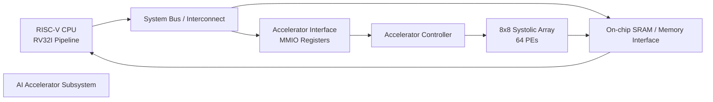
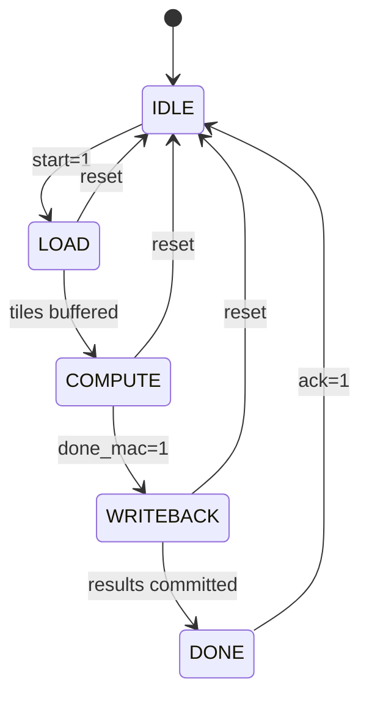

# SoC Architecture

This SoC integrates a **RISC-V CPU pipeline** with a **memory-mapped AI accelerator subsystem** for matrix-multiply workloads.

## Component Responsibilities

- **CPU (RV32I pipeline)**: runs control code, programs accelerator registers, and handles system tasks.
- **System interconnect**: routes memory and MMIO transactions.
- **Memory interface / SRAM**: stores operands and output tiles.
- **Accelerator interface (MMIO)**: exposes configuration and status registers to software.
- **Accelerator controller**: sequences load, compute, and writeback phases.
- **8×8 systolic array**: performs highly parallel MAC operations.

## Architecture Overview

## Accelerator Control State Diagram

## Software-to-Hardware Control Sequence

1. CPU writes source/destination pointers and tile metadata into MMIO registers.
2. CPU asserts `start` through the accelerator interface.
3. Controller transitions `IDLE → LOAD → COMPUTE → WRITEBACK`.
4. CPU polls/receives `done` and acknowledges completion.

This separation keeps software control simple while preserving high compute density in hardware.
