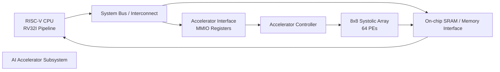
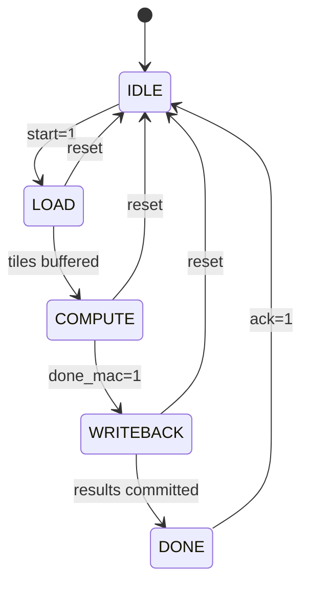

# SoC Architecture

The system integrates a RISC-V compatible processor with a custom AI accelerator.

## Architecture Overview (Flowchart)

## Accelerator Control State Diagram

The CPU configures control registers through MMIO, the controller sequences data movement and compute, and the systolic array performs matrix multiplication.

## Figma / Tooling Notes

- Use **Figma** to polish this architecture with component frames for CPU, memory, controller, and array.
- Use **Mermaid Live Editor** or **draw.io / diagrams.net** to iterate on flow/state diagrams quickly, then paste exported SVGs into design reviews.
- Keep naming aligned with RTL modules (`cpu_pipeline`, `accelerator_controller`, `systolic_array_8x8`) for traceability.
