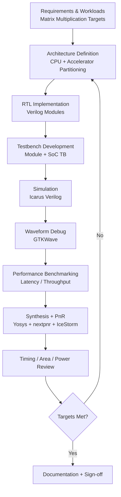
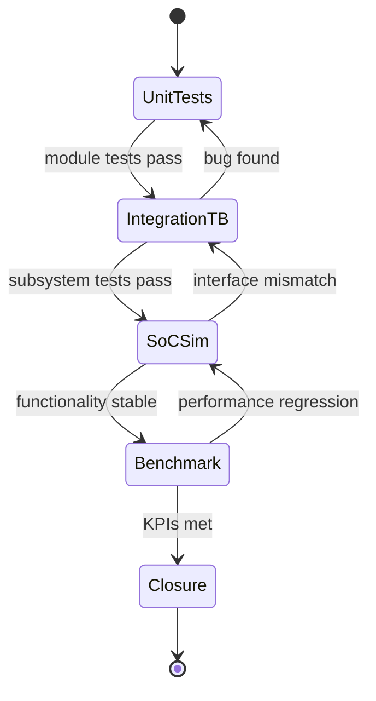

# Design Flow

The project follows a standard hardware design and verification flow:

1. Architecture design
2. RTL implementation in Verilog
3. Testbench development
4. Simulation using Icarus Verilog
5. Waveform analysis using GTKWave
6. Performance evaluation
7. FPGA synthesis using Yosys + nextpnr + IceStorm

## Reproducible Commands

Use the Makefile targets to run the flow:

```bash
make sim-all
make synth
```

Individual simulation targets are also available (`sim-alu`, `sim-cpu`, `sim-accel`, etc.) for focused debugging.
The project follows a standard hardware design and validation flow.

## End-to-End Development Flowchart



## Verification State Diagram



## Tooling

- Architecture and presentation diagrams: **Figma**
- Fast editable engineering diagrams: **Mermaid**, **draw.io/diagrams.net**
- Simulation and debug: **Icarus Verilog + GTKWave**
- Synthesis and implementation: **Yosys + nextpnr + IceStorm**
