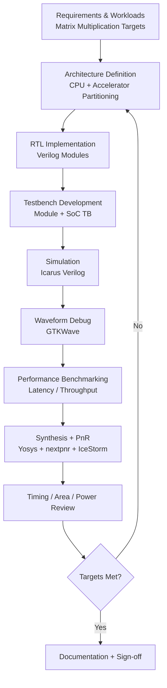
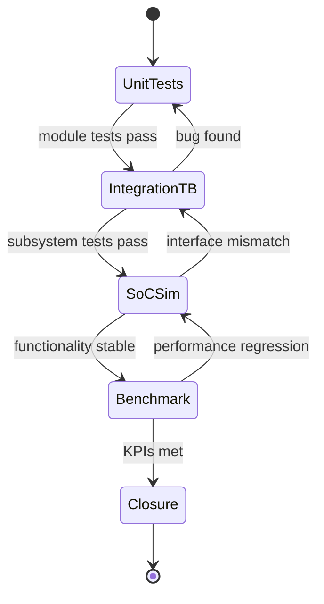

# Design & Verification Flow

This project follows a hardware-first workflow optimized for rapid RTL iteration and reproducible simulation/synthesis results.

## End-to-End Stages

1. **Architecture definition** (CPU/accelerator partitioning)
2. **RTL implementation** (Verilog modules)
3. **Testbench authoring** (module + subsystem level)
4. **Simulation** (Icarus Verilog)
5. **Waveform/debug** (GTKWave)
6. **Benchmarking** (latency and throughput)
7. **FPGA synthesis + PnR** (Yosys + nextpnr + IceStorm)

## Reproducible Commands

```bash
make sim-all
make synth
```

For targeted debug loops, run individual simulation targets such as:

- `make sim-alu`
- `make sim-decoder`
- `make sim-regfile`
- `make sim-cpu`
- `make sim-cpu-pipeline`
- `make sim-systolic`
- `make sim-accel`

## Development Lifecycle Diagram



## Verification Maturity State Diagram



## Tooling

- Diagram authoring and architecture communication: **Mermaid / draw.io / Figma**
- Simulation and debug: **Icarus Verilog + GTKWave**
- Synthesis and implementation: **Yosys + nextpnr + IceStorm**
