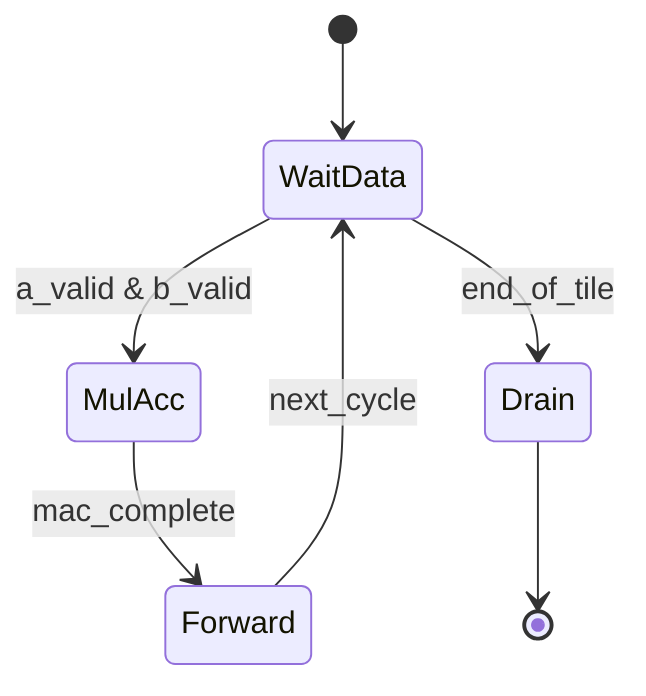

# Systolic Array Accelerator

The accelerator implements a **systolic array architecture** for efficient matrix multiplication.

## Processing Element (PE)

Each PE performs:

- Multiply operation
- Accumulate operation
- Data forwarding to neighboring PEs

## Dataflow Diagram (8x8 Concept)

```mermaid
flowchart LR
    A[Matrix A Stream\n(rows)] --> SA[Systolic Array Grid\nPE(0,0) ... PE(7,7)]
    B[Matrix B Stream\n(columns)] --> SA
    SA --> C[Partial Sums]
    C --> D[Matrix C Output]
```

## PE Lifecycle State Diagram



## Rhythmic Data Propagation

- A operands move horizontally across rows.
- B operands move vertically across columns.
- Each PE accumulates local partial sums and forwards data every cycle.
- After pipeline fill, one result can be produced per cycle (for the active diagonal wavefront).

## Diagram Authoring Tips

- Create polished visuals in **Figma** using an 8x8 component grid for PEs.
- Keep a lightweight source-of-truth in **Mermaid** for version-controlled diffs.
- Use **draw.io/diagrams.net** when you need drag-and-drop arrows and lane annotations.
