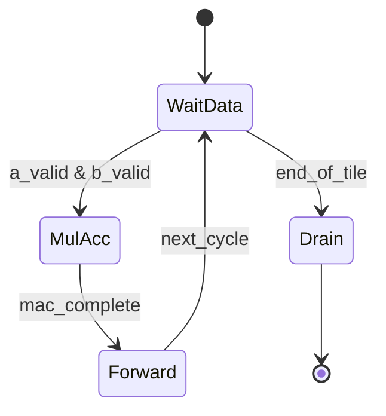

# Systolic Array Accelerator

The accelerator uses a **systolic-array dataflow** to speed up matrix multiplication through localized, pipelined MAC operations.

## Why Systolic?

- High data reuse across neighboring processing elements (PEs)
- Predictable, regular interconnect and timing behavior
- Good fit for tiled GEMM-style workloads

## Processing Element (PE) Behavior

Each PE is responsible for:

- **Multiply** incoming `A` and `B` operands
- **Accumulate** into a local partial-sum register
- **Forward** operands to downstream neighbors

## Dataflow Diagram (8×8 Concept)

```mermaid
flowchart LR
    A[Matrix A Stream\n(rows)] --> SA[Systolic Array Grid\nPE(0,0) ... PE(7,7)]
    B[Matrix B Stream\n(columns)] --> SA
    SA --> C[Partial Sums]
    C --> D[Matrix C Output]
```

## PE Lifecycle State Diagram



## Rhythm of Computation

- `A` operands flow left-to-right across rows.
- `B` operands flow top-to-bottom across columns.
- Partial sums build up cycle-by-cycle inside each PE.
- After pipeline fill, the array can sustain a high output cadence for active tiles.

## Practical Notes for Iteration

- Validate with small tiles first (2×2, 4×4) before full 8×8 runs.
- Keep PE interfaces minimal and timing-aware to ease scaling.
- Use waveform checkpoints at tile boundaries (`LOAD`, `COMPUTE`, `WRITEBACK`) for fast debug.
